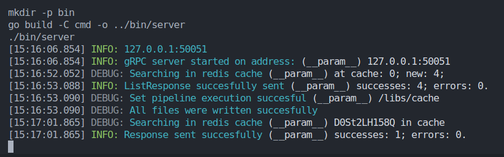

# Thumbnails microservice
Это gRPC сервер предназначенный для проксирования YouTube API запросов. В конкретной текущей конфигурации это сервис оптимальной доставки пользователям превью видео по переданной в запросе ссылке. Быстрая доставка осуществляется за счет кэширования превью видео и его мета данных в файловой системе и Redis соответственно.

---

## Установка

1. Клонируйте репозиторий в любую подходящую директорию:

```
git clone https://github.com/fluxx1on/thumbnails_microservice.git
```

2. Убедитесь что у вас установлен Golang версии старше 1.19. Также для запуска может потребоваться Redis. Если не установлен смотреть сноску внизу страницы.

3. Запустите настройку окружения и установку зависимостей через Makefile в корневой папке проекта:

```
make setup
```

4. После выполнения команды появится файл .env содержащий конфигурацию переменных окружения. Все настройки за исключением API ключа YT будут уже выставлены по умолчанию. Ключ можно получить на странице [официального API-сервиса ютуба](https://console.cloud.google.com/apis/).

5. Осталось только запустить сервер:

```
make run
```

---

## Общие сведения

- Язык программирования - Go ;
- Используемые технологии: gRPC, HTTP, Redis, Protobuf ;
- Логгер - slog ;
- Журналирование - включено ;
- Кэширование выполняется в основном потоке и не затрагивает жизненный цикл Handler-ов ;



Формат YouTube видео URL:

```
https://www.youtube.com/watch?v=QFxZlKb7W2k&ab_channel=TECHSCHOOL
```

#### Сноска
Redis должен быть запущен и правильно настроен в переменных окружения среды, чтобы работать с кэшированием. В случае если по какой-то причине нет возможности поставить и запустить Redis - для корректной работы сервиса необходимо в файле main.go закомментировать строчки 53-57 включительно. Однако в таком случае кэширование перестанет работать и сервис полностью переориентируется на YouTube API.
